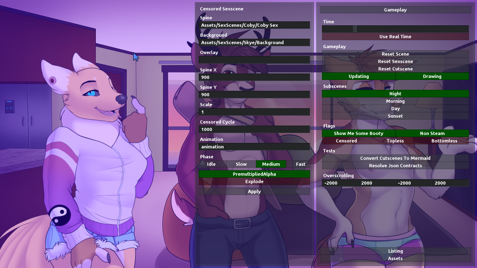
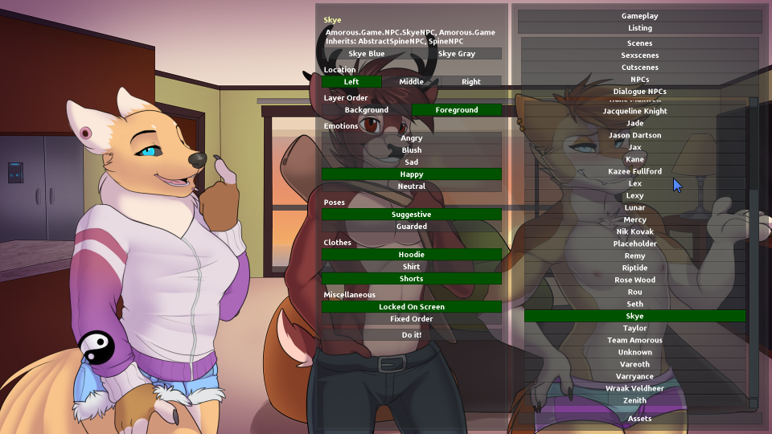
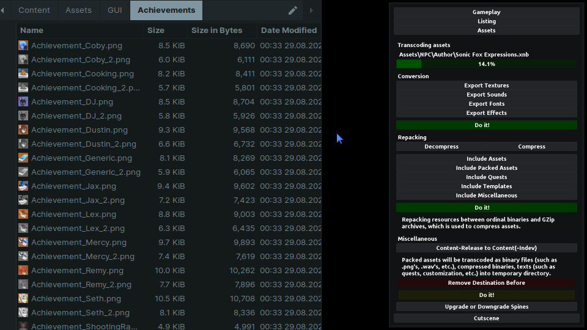
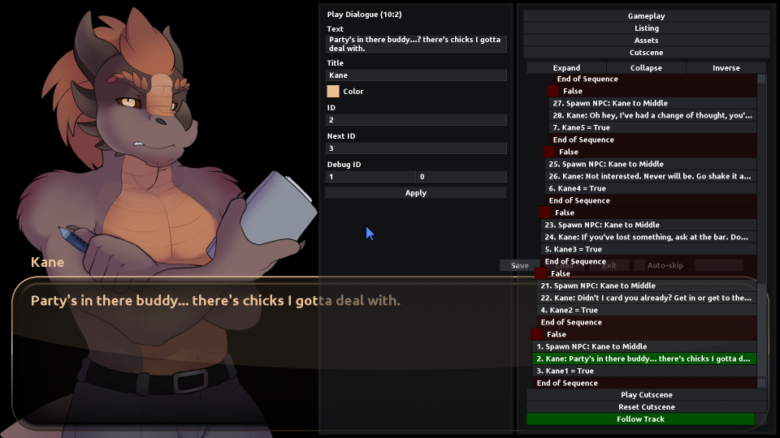
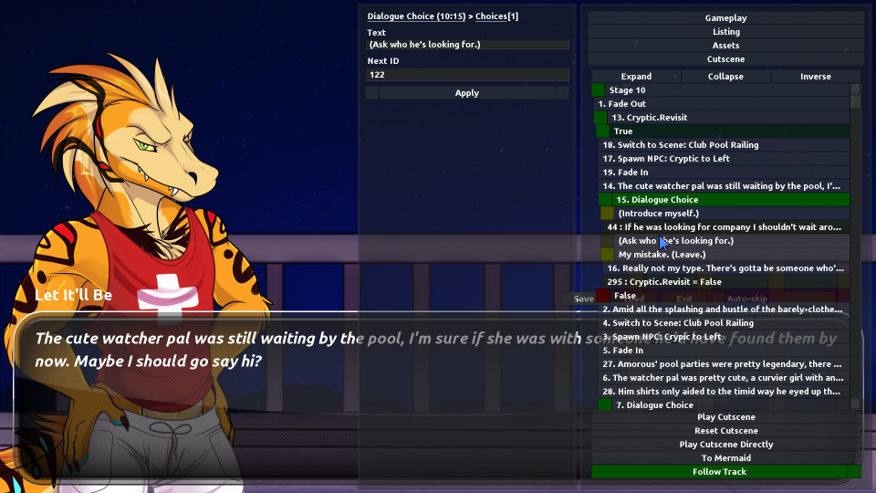

# Amorous Explorer — repacking with testing

Thrust yourself to the front of the line of [Amorous](https://store.steampowered.com/app/778700/Amorous/), a bustling furry night club that invites you to explore it's neon lights and eccentric characters. Immerse yourself with a fleshed out character creator and treat yourself to a varied cast of potential dates to explore! Use explorer to view contents, a whole assembly of tools for testing and repacking content comes to your aid.

## Installing

First of all, start by finding folder with your game, for Steam it is usually enough to [open the local Amorous folder in library](https://savelocation.net/steam-game-folder). Download [an artifact from recent runs](https://github.com/rislaed/amorous-explorer/actions/workflows/deploy.yml), resulting archive contains necessary libraries and executables. Duplicate game folder to any other location (for example, to desktop) by unpacking contents of downloaded archive into it and agreeing to replacing or merging. When installing on any Unix-like system, rename ALL files Amorous.Game.Unix.\* to Amorous.Explorer.\* (e.g., Amorous.Game.Unix.bin.osx -> Amorous.Explorer.bin.osx), also change references in renamed Amorous.Explorer executable. Run Amorous.Explorer.exe or Amorous.Explorer and you've done!

## What it can do?

Before do something, just unpack downloaded release archive into any version of Amorous (any supported, but 1.0.4 is preffered). Features and tools are collected in an additional menu displayed on top of it. By default, you will be greeted by a menu with an empty screen, only the engine itself starts with preloading resources. Use `~` to hide the menu or display it again, in conjunction with the built-in debugging on `Tab`.

### Gameplay

In gameplay tab providen data common to the entire game or current state:

- Changing the time in the game, usually changes the subscenes, or affects the color rendering
- Reset or completion of the current scene, subscene, love including
- Suspension of logic and rendering of content on the screen, automatically called in case of fatal errors
- Changing the subscenes of the current scene, changing global flags by type of censorship and the presence of Steam (will not update the content on the screen)
- Various tests and other possibilities not brought to the ideal

### Listing

Listing of content includes many submenus for use in other editors and creating or switching to other states:

- Change current scene, cutscene, love overlay and view the active ones
- Place NPCs on your screen, especially during dialogues to create stories in quests
  - Choose a position, poses, emotions and pick up clothes
- Additionally select contacts and others in this submenu

### Assets

Following content processing tools are currently available:

- Decompilation of any textures available for in-game (images, character sprites, etc.), sounds (will be saved in file format.wav), fonts (including sprites and JSON descriptions for editing) and animation effects
- Compression and decompression of various content, including quests, skeletons and images (and not only, using gzipping)
- Universal exporting of decompiled and decompressed resources, combines previous options
- Export skeletons for use in Spine and backport back

### Cutscene

By selecting a cutscene, an additional tab is activated with it's editing:

- By choosing a node in tree, you can change any properties in interface, and since this is a regular JSON, they will not fundamentally differ from each other (this includes convenient editing of arrays and objects with the same property editors)
- Play cutscene starting from selected node, stop and track data of following events in tree
- Export quest logic to [Mermaid](https://mermaid.js.org/intro/) to study it more thoroughly even faster

## Contributing

You will need an original game to run, any computer platform might do it. Just place game files in repository folder, run build and contribute something new to project. There will be no further instructions.
